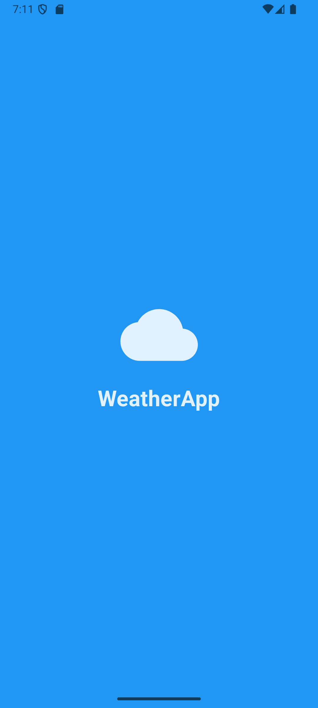
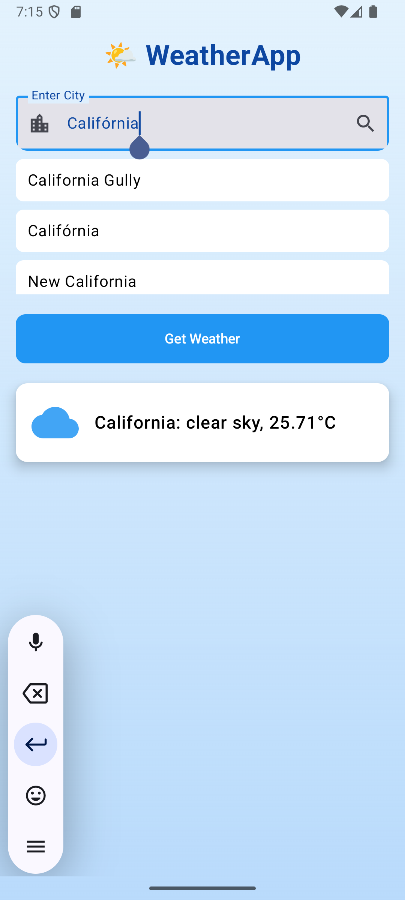

# 📱 Weather Now

تطبيق Android يعرض حالة الطقس الحالية لأي مدينة حول العالم، باستخدام واجهة حديثة ورسوميات جميلة، ويعتمد على واجهة برمجة التطبيقات (API) من OpenWeatherMap.

---

## 🌟 المميزات

- البحث عن الطقس حسب المدينة
- اقتراحات تلقائية عند كتابة اسم المدينة
- عرض حالة الطقس الحالية (درجة الحرارة، وصف الحالة)
- عرض أيقونة الطقس
- تصميم جميل ومتجاوب مع الوضع الليلي

---

## 📸 لقطات شاشة

  
  

---

## 🔧 طريقة الاستخدام

1. افتح التطبيق.
2. اكتب اسم المدينة.
3. اختر من الاقتراحات أو اضغط على "Get Weather".
4. سيُعرض الطقس الحالي بشكل جذاب.

---

## 🛠️ المتطلبات

- Android Studio (Arctic Fox أو أحدث)
- Android SDK 21+
- اتصال بالإنترنت
- مفتاح API من [OpenWeatherMap](https://openweathermap.org/)

---

## 🧪 مستقبلًا

- دعم المواقع الجغرافية التلقائية
- دعم للغات متعددة
- عرض الطقس للأيام القادمة
- ودجت للشاشة الرئيسية

---

## 📄 الرخصة

مشروع مفتوح المصدر لأغراض التعلم.
